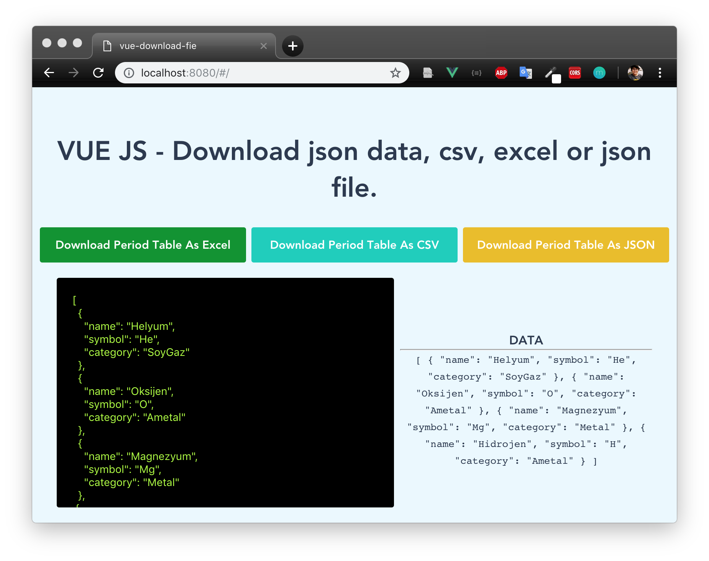
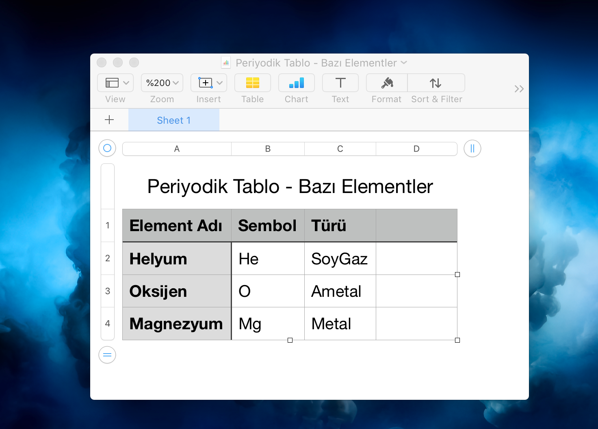
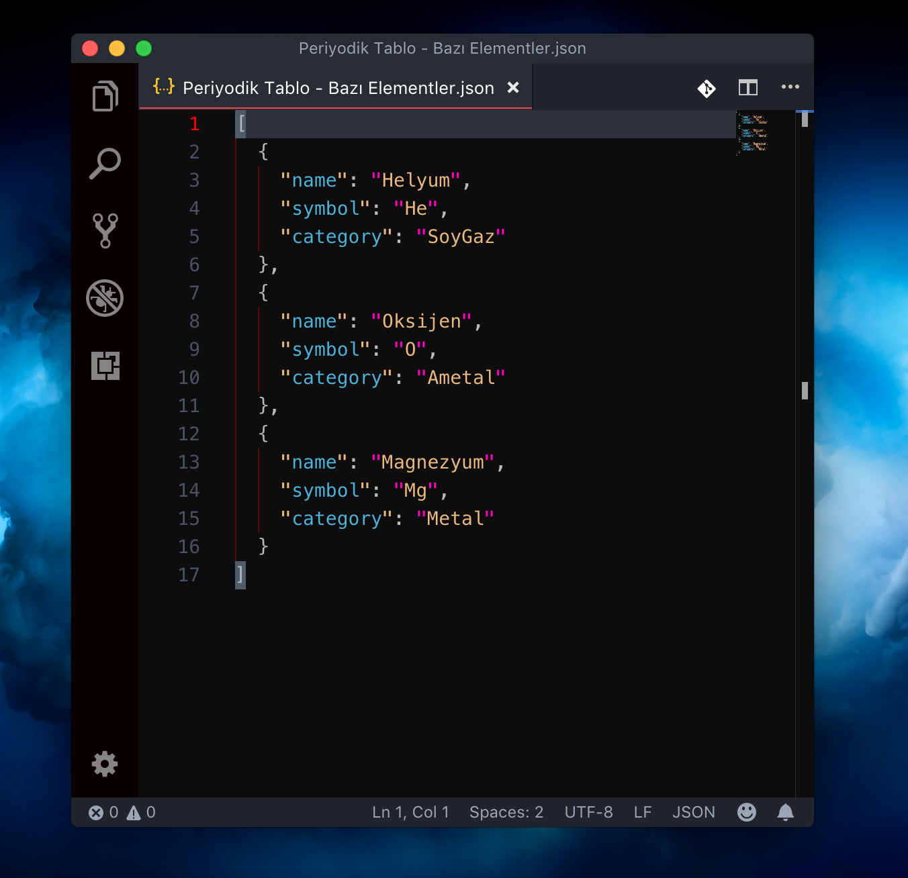

# Download Json Data with VUE Components






# Install
```
   yarn add json-data-convert-file   
```

# Using

> import download components
<br/>
  
   import Download from '@/components/Download'

 ```html
   <Download :download-data="periodicTable"
            file-type="xls"
            file-name="Periyodik Tablo - Bazı Elementler"
            :data-titles="titles"
            class="periodic_table color-1"
            button-text="Download Period Table As Excel"/>

```


## Build Setup

``` bash
# install dependencies
npm install

# serve with hot reload at localhost:8080
npm run dev

# build for production with minification
npm run build

# build for production and view the bundle analyzer report
npm run build --report
```

For a detailed explanation on how things work, check out the [guide](http://vuejs-templates.github.io/webpack/) and [docs for vue-loader](http://vuejs.github.io/vue-loader).
